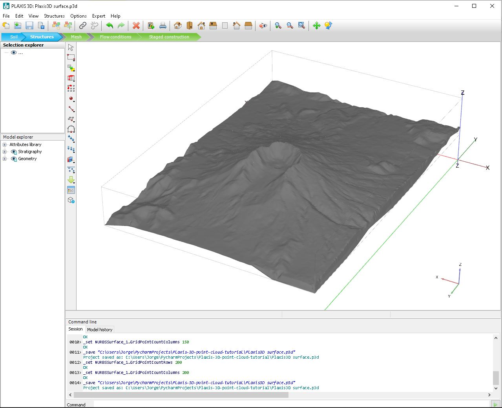

<!-- ABOUT THE PROJECT -->
## About The Project

Simple python script created to demonstrate typical workflow of importing x y z surface data to Plaxis 3D software.

**generate_point_cloud_data.py** file performs the following tasks:
1. Download [Mount St. Helens](https://docs.pyvista.org/#maps-and-geoscience) surface data
2. Generate **point_cloud_data.txt** file from [1] data for Plaxis 3D import
3. Generate **point_cloud_data.png file** from [1] for Plaxis 3D validation

**Plaxis3D surface.p3d** is the Plaxis 3D project file with surface data already imported. Screenshot as follows:

If you want to import a Civil 3D surface to Plaxis 3D then using Toolbox->Reports->Surface->Surface Points to CSV is recommended to get raw x y z surface data.

<!-- CONTACT -->
## Contact

subsurfaceio - [subsurfaceio.mail@gmail.com](mailto:subsurfaceio.mail@gmail.com)
